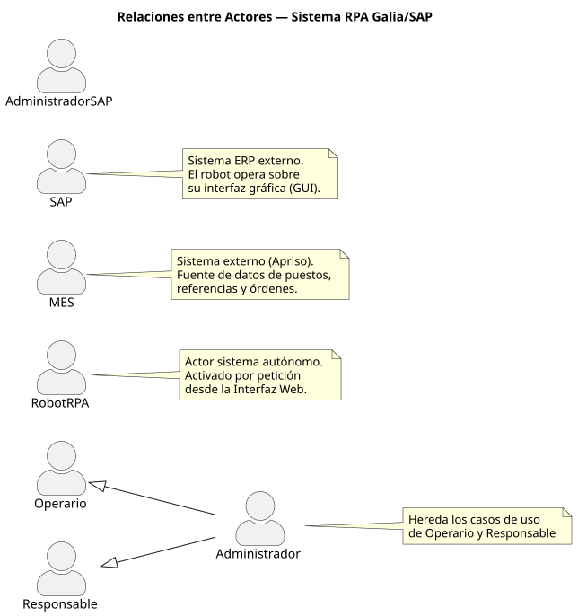
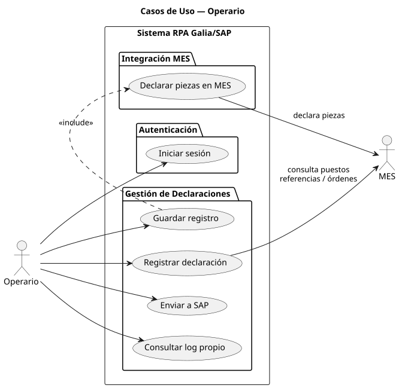
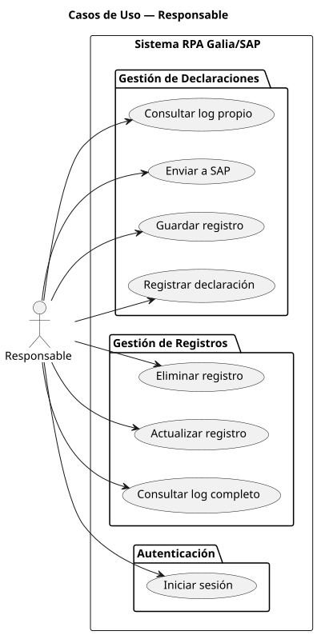
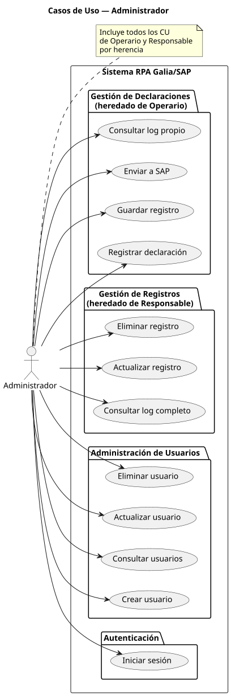
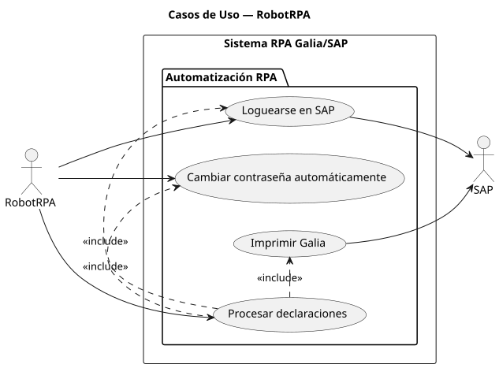
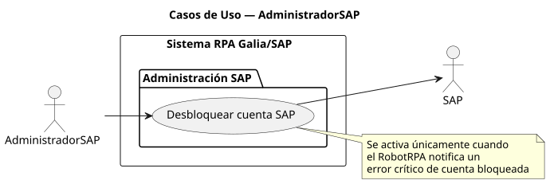

<!-- NAV: adapta los paths según la profundidad del archivo (../../) -->

<table><tr>
<td><a href="../../README.md">🏠 Inicio</a></td>
<td><b>·</b></td>
<td><a href="../../01-inicio/README.md"
   style="background:#dbeafe;padding:4px 10px;border-radius:12px;color:#1d4ed8;font-weight:bold;text-decoration:none">
   📋 01 · Inicio</a></td>
<td><b>·</b></td>
<td><a href="../../02-elaboracion/README.md"
   style="padding:4px 10px;border-radius:12px;color:#57606a;text-decoration:none">
   🔬 02 · Elaboración</a></td>
<td><b>·</b></td>
<td><a href="../../03-construccion/README.md"
   style="padding:4px 10px;border-radius:12px;color:#57606a;text-decoration:none">
   🔨 03 · Construcción</a></td>
<td><b>·</b></td>
<td><a href="../../04-transicion/README.md"
   style="padding:4px 10px;border-radius:12px;color:#57606a;text-decoration:none">
   🚀 04 · Transición</a></td>
</tr></table>

📋 Ver todas las secciones del repositorio

 

<table>
<tr><th>📋 01 · Inicio</th><th>🔬 02 · Elaboración</th><th>🔨 03 · Construcción</th><th>🚀 04 · Transición</th></tr>
<tr>
<td valign="top">

[📌 Visión y Justificación](../../01-inicio/vision-justificacion/README.md)
[🧩 Modelo del Dominio](../../01-inicio/modelo-dominio/README.md)
[👥 Actores y CU alto nivel](../../01-inicio/casos-de-uso-alto-nivel/README.md)
[⚠️ Análisis de Riesgos](../../01-inicio/analisis-riesgos/README.md)
[📖 Glosario](../../01-inicio/glosario/README.md)

</td>
<td valign="top">

[🏗️ Arquitectura del Sistema](../../02-elaboracion/arquitectura/README.md)
[🔄 Diagramas de Estado](../../02-elaboracion/diagramas-estado/README.md)
[📝 Casos de Uso Detallados](../../02-elaboracion/casos-de-uso-detallados/README.md)
[⚖️ Priorización de CU](../../02-elaboracion/priorizacion-cu/README.md)
[📋 Requisitos RF/RNF](../../02-elaboracion/requisitos/README.md)

</td>
<td valign="top">

[🎨 Diseño por Caso de Uso](../../03-construccion/diseno-por-caso-de-uso/README.md)
[📦 Análisis de Paquetes](../../03-construccion/analisis-paquetes/README.md)
[🗄️ Base de Datos](../../03-construccion/base-de-datos/README.md)
[🤖 Robot UiPath](../../03-construccion/robot-uipath/README.md)
[💻 Descripción Solución](../../03-construccion/descripcion-solucion/README.md)
[⚙️ Instalación](../../03-construccion/instalacion/README.md)

</td>
<td valign="top">

[🧪 Plan de Pruebas](../../04-transicion/plan-pruebas/README.md)
[🖥️ CU en Interfaz](../../04-transicion/cu-en-interfaz/README.md)
[📊 Resultados y Métricas](../../04-transicion/resultados-metricas/README.md)
[🎓 Conclusiones](../../04-transicion/conclusiones/README.md)

</td>
</tr>
</table>

📍 Estás en: <b>Actores y CU alto nivel</b>

***

# 👥 Actores y Casos de Uso de Alto Nivel

En esta sección se identifican los actores que interactúan con el sistema y las funcionalidades principales agrupadas a alto nivel.

## Actores del Sistema

| Actor             | Tipo      | Descripción                                                                                                        |
| ----------------- | --------- | ------------------------------------------------------------------------------------------------------------------ |
| **Operario**      | Principal | Introduce datos de producción y activa el proceso de envío a SAP.                                                  |
| **Responsable**   | Principal | Supervisa los logs de ejecución y gestiona registros existentes.                                                   |
| **Administrador** | Principal | Gestiona los usuarios del sistema y la configuración global, tiene acceso a todas las funcionalidades del sistema. |
| **Robot RPA**     | Sistema   | Ejecuta de forma autónoma las tareas en la interfaz de SAP.                                                        |
| **SAP / MES**     | Externo   | Sistemas con los que se integra la solución.                                                                       |

*Principales interacciones entre los actores.*;

## Diagramas de Casos de Uso de los actores (Alto Nivel)

*Principales interacciones de los actores con el sistema.*

## Funcionalidades Principales

- **Gestión de Declaraciones:** Captura de datos de planta y persistencia.
- **Automatización SAP:** Ejecución de transacciones mediante el robot RPA.
- **Control de Acceso:** Gestión de identidades y roles (Operario, Responsable, Admin).
- **Monitorización:** Registro y consulta de logs de actividad del robot.
- **Autogestión RPA:** Cambio automático de credenciales SAP.

