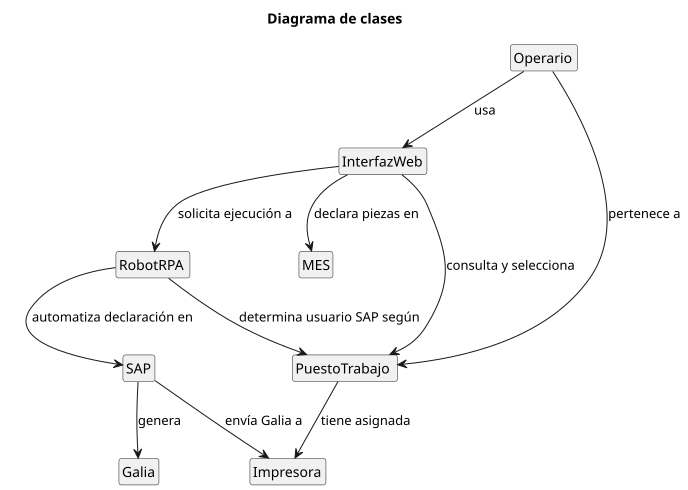
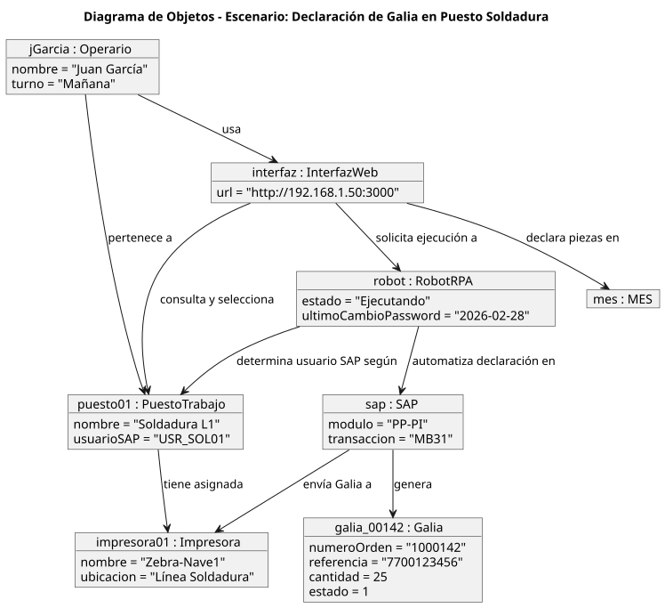

# 01 · Presentación del Proyecto

## Problema detectado en Maflow Spain Automotive
El proceso de generación de documentos **Galia (ETI 9)** en SAP presentaba graves deficiencias operativas antes de la implementación de esta solución:
- **Lentitud extrema:** El proceso manual consumía aproximadamente 2 minutos por cada documento.
- **Duplicidad de esfuerzo:** Los operarios introducían los mismos datos manualmente tanto en SAP como en el sistema MES (Apriso).
- **Restricción técnica:** La ausencia de acceso a APIs de SAP impedía el uso de métodos de integración convencionales.
- **Falta de escalabilidad:** No existía capacidad de procesamiento en lote; cada documento debía generarse de forma individual.
- **Riesgo de calidad:** Los errores de transcripción manual afectaban negativamente la trazabilidad entre Maflow y sus clientes OEM.

## Solución Propuesta
Se ha desarrollado una solución basada en **RPA (Robotic Process Automation)** que opera directamente sobre la SAP GUI, superando la limitación de falta de APIs.

### Flujo de Trabajo
1. El operario introduce los datos en la **Interfaz Web**.
2. Al pulsar **Guardar**, los datos se persisten en la BD y se declaran en el sistema MES.
3. Al pulsar **Enviar a SAP**, se activa el robot UiPath.
4. El robot se loguea en SAP y procesa en lote todos los registros pendientes.

## Modelo del Dominio
El modelo del dominio identifica las entidades fundamentales que participan en el proceso de automatización.

### Diagrama de Clases

### Entidades Principales
| Entidad | Descripción |
| :--- | :--- |
| **Operario** | Usuario final que introduce los datos en la interfaz web. |
| **PuestoTrabajo** | Determina las credenciales de acceso a SAP y la impresora destino. |
| **RobotRPA** | Proceso automatizado encargado de la interacción con SAP. |
| **Galia** | Documento de trazabilidad objeto de la automatización. |

### Escenario de Ejemplo (Diagrama de Objetos)

---

| ← Anterior | Inicio | Siguiente → |
|:---:|:---:|:---:|
| - | [🏠 Inicio](../README.md) | [02 · Actores y Casos de Uso](../02_actores_casos_uso/README.md) |

