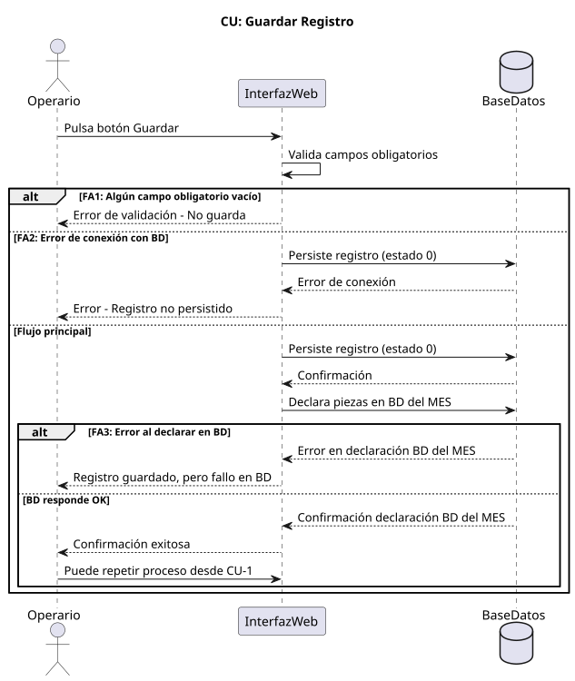
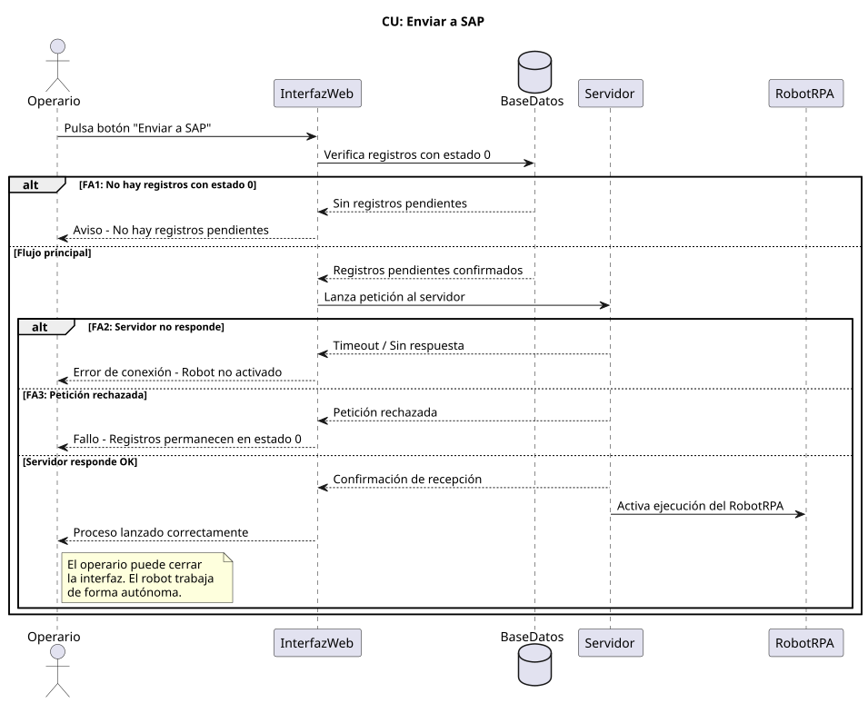
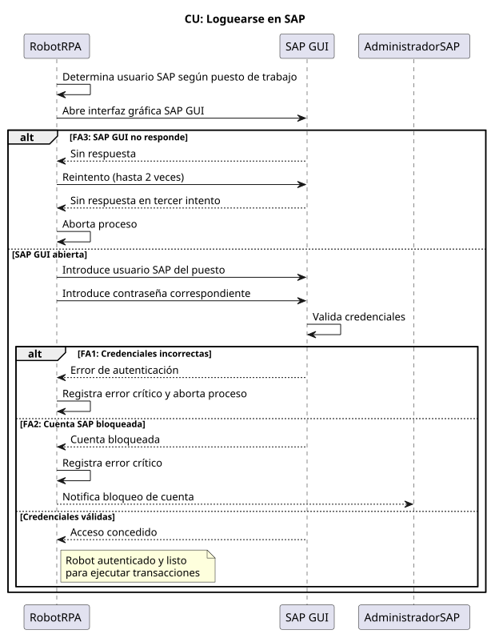
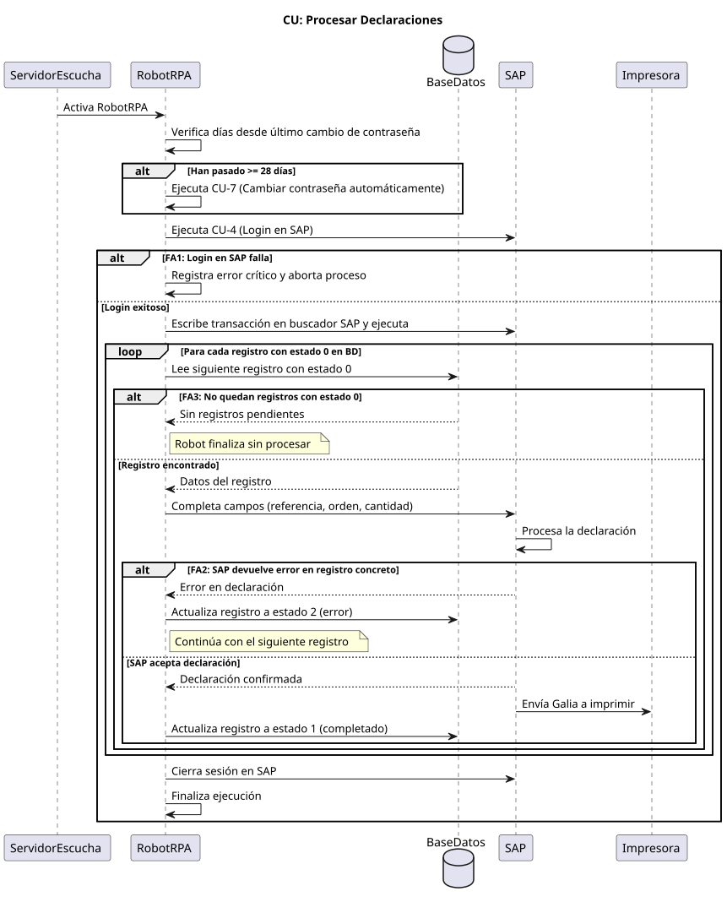
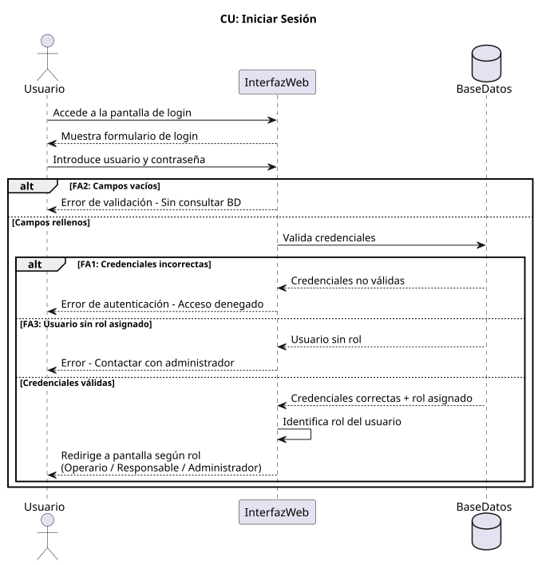
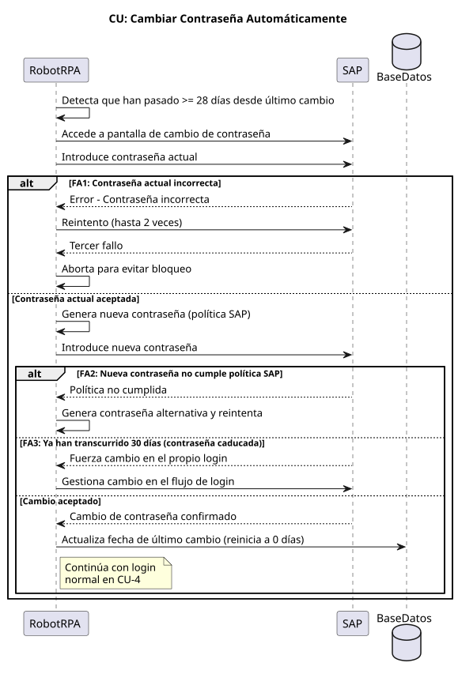
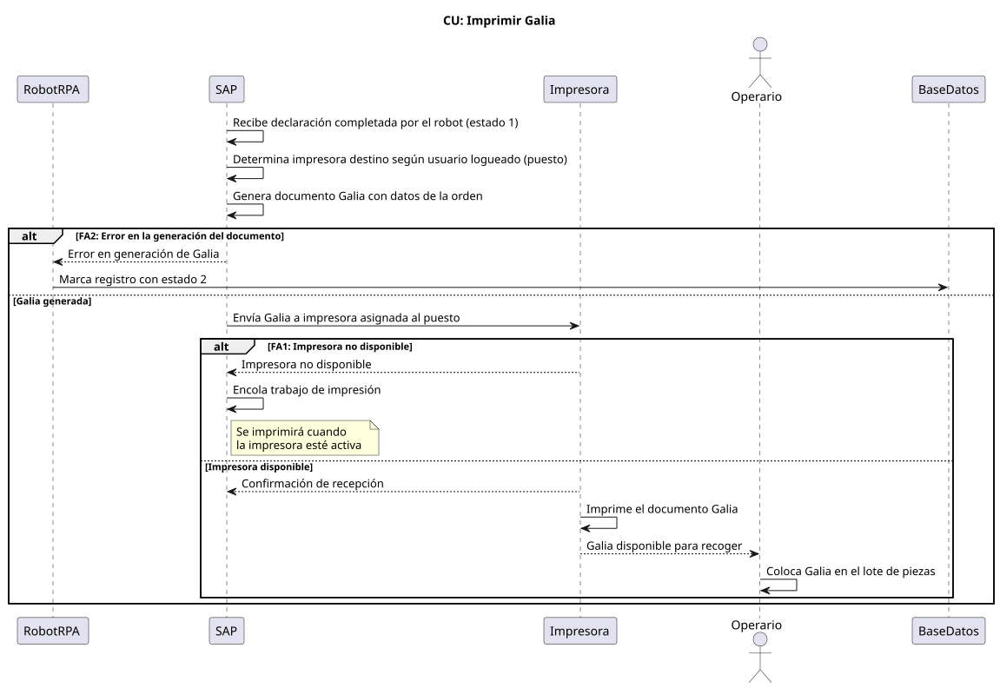
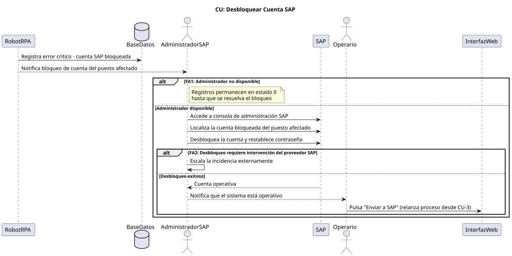

<!-- NAV: adapta los paths según la profundidad del archivo (../../) -->

<table><tr>
<td><a href="../../README.md">🏠 Inicio</a></td>
<td><b>·</b></td>
<td><a href="../../01-inicio/README.md"
   style="padding:4px 10px;border-radius:12px;color:#57606a;text-decoration:none">
   📋 01 · Inicio</a></td>
<td><b>·</b></td>
<td><a href="../../02-elaboracion/README.md"
   style="background:#dbeafe;padding:4px 10px;border-radius:12px;color:#1d4ed8;font-weight:bold;text-decoration:none">
   🔬 02 · Elaboración</a></td>
<td><b>·</b></td>
<td><a href="../../03-construccion/README.md"
   style="padding:4px 10px;border-radius:12px;color:#57606a;text-decoration:none">
   🔨 03 · Construcción</a></td>
<td><b>·</b></td>
<td><a href="../../04-transicion/README.md"
   style="padding:4px 10px;border-radius:12px;color:#57606a;text-decoration:none">
   🚀 04 · Transición</a></td>
</tr></table>

📋 Ver todas las secciones del repositorio

 

<table>
<tr><th>📋 01 · Inicio</th><th>🔬 02 · Elaboración</th><th>🔨 03 · Construcción</th><th>🚀 04 · Transición</th></tr>
<tr>
<td valign="top">

[📌 Visión y Justificación](../../01-inicio/vision-justificacion/README.md)
[🧩 Modelo del Dominio](../../01-inicio/modelo-dominio/README.md)
[👥 Actores y CU alto nivel](../../01-inicio/casos-de-uso-alto-nivel/README.md)
[⚠️ Análisis de Riesgos](../../01-inicio/analisis-riesgos/README.md)
[📖 Glosario](../../01-inicio/glosario/README.md)

</td>
<td valign="top">

[🏗️ Arquitectura del Sistema](../../02-elaboracion/arquitectura/README.md)
[🔄 Diagramas de Estado](../../02-elaboracion/diagramas-estado/README.md)
[📝 Casos de Uso Detallados](../../02-elaboracion/casos-de-uso-detallados/README.md)
[⚖️ Priorización de CU](../../02-elaboracion/priorizacion-cu/README.md)
[📋 Requisitos RF/RNF](../../02-elaboracion/requisitos/README.md)

</td>
<td valign="top">

[🎨 Diseño por Caso de Uso](../../03-construccion/diseno-por-caso-de-uso/README.md)
[📦 Análisis de Paquetes](../../03-construccion/analisis-paquetes/README.md)
[🗄️ Base de Datos](../../03-construccion/base-de-datos/README.md)
[🤖 Robot UiPath](../../03-construccion/robot-uipath/README.md)
[💻 Descripción Solución](../../03-construccion/descripcion-solucion/README.md)
[⚙️ Instalación](../../03-construccion/instalacion/README.md)

</td>
<td valign="top">

[🧪 Plan de Pruebas](../../04-transicion/plan-pruebas/README.md)
[🖥️ CU en Interfaz](../../04-transicion/cu-en-interfaz/README.md)
[📊 Resultados y Métricas](../../04-transicion/resultados-metricas/README.md)
[🎓 Conclusiones](../../04-transicion/conclusiones/README.md)

</td>
</tr>
</table>

📍 Estás en: <b>Casos de Uso Detallados</b>

***

# 📝 Casos de Uso Detallados

Se han identificado un total de 17 casos de uso (CU) que cubren todas las funcionalidades necesarias para la gestión de Galias y la administración del sistema.

## Listado de Casos de Uso

| CU       | Nombre                       | Actor Principal | Prioridad |
| -------- | ---------------------------- | --------------- | --------- |
| **CU1**  | Registrar declaración        | Operario        | Alta      |
| **CU2**  | Guardar registro             | Operario        | Alta      |
| **CU3**  | Enviar a SAP                 | Operario        | Alta      |
| **CU4**  | Loguearse en SAP             | RobotRPA        | Alta      |
| **CU5**  | Procesar declaraciones       | RobotRPA        | Alta      |
| **CU6**  | Iniciar sesión               | Todos           | Alta      |
| **CU7**  | Cambio automático contraseña | RobotRPA        | Media     |
| **CU8**  | Imprimir Galia               | SAP             | Media     |
| **CU9**  | Consultar log propio         | Operario        | Media     |
| **CU10** | Consultar log completo       | Responsable     | Media     |
| **CU11** | Actualizar registro          | Responsable     | Media     |
| **CU12** | Crear usuario                | Administrador   | Baja      |
| **CU13** | Consultar usuarios           | Administrador   | Baja      |
| **CU14** | Actualizar usuario           | Administrador   | Baja      |
| **CU15** | Eliminar usuario             | Administrador   | Baja      |
| **CU16** | Eliminar registro            | Responsable     | Baja      |
| **CU17** | Desbloquear cuenta SAP       | AdminSAP        | Baja      |

## Detalle de Actores

- **Operario:** Usuario principal en planta. Introduce datos.
- **Responsable:** Supervisa la producción y corrige errores de registro.
- **Administrador:** Gestión total de identidades y roles.
- **RobotRPA:** Actor de sistema que automatiza la interacción con SAP GUI.
- **AdministradorSAP:** Interviene solo en casos críticos de bloqueo de cuenta.

***

## Detalle de los Casos de Uso Principales

A continuación se detallan los casos de uso nucleares del sistema, incluyendo sus diagramas de secuencia, flujos y condiciones.

### CU1: Registrar declaración

| Campo               | Descripción                                                                 |
| :------------------ | :-------------------------------------------------------------------------- |
| **Actor principal** | Operario                                                                    |
| **Precondición**    | El operario tiene acceso a la Interfaz Web y hay puestos activos en el MES. |
| **Postcondición**   | Puesto, referencia, orden y cantidad listos para guardar.                   |

#### Diagrama de Secuencia

#### Flujo Principal

1. El operario accede a la Interfaz Web.
2. El sistema consulta al MES y muestra los puestos disponibles.
3. El operario selecciona su puesto.
4. El sistema filtra y muestra las referencias con órdenes abiertas en ese puesto.
5. El operario selecciona la orden.
6. El sistema muestra las referencias para esa orden.
7. El operario selecciona la referencia.
8. El sistema muestra la cantidad producida anteriormente.
9. El operario introduce la cantidad a declarar.

#### Flujos Alternativos

| ID      | Condición                                  | Acción                                            |
| :------ | :----------------------------------------- | :------------------------------------------------ |
| **FA1** | No hay puestos activos en MES              | El sistema muestra error y bloquea el formulario. |
| **FA2** | No hay referencias abiertas en el puesto   | El desplegable de referencias aparece vacío.      |
| **FA3** | No hay órdenes abiertas para la referencia | El desplegable de órdenes aparece vacío.          |

***

### CU2: Guardar registro

| Campo               | Descripción                                                         |
| :------------------ | :------------------------------------------------------------------ |
| **Actor principal** | Operario                                                            |
| **Precondición**    | CU1 completado; puesto, referencia, orden y cantidad introducidos   |
| **Postcondición**   | Registro persistido en BD con estado = 0 y piezas declaradas en MES |

#### Diagrama de Secuencia

#### Flujo Principal

1. El operario pulsa el botón Guardar
2. El sistema valida que todos los campos obligatorios están rellenos
3. El sistema persiste el registro en la BD con estado = 0
4. El sistema declara simultáneamente las piezas en el MES
5. El sistema muestra confirmación al operario
6. El operario puede repetir el proceso desde CU1 para añadir más registros

#### Flujos Alternativos

| ID      | Condición                     | Acción                                                |
| :------ | :---------------------------- | :---------------------------------------------------- |
| **FA1** | Algún campo obligatorio vacío | El sistema muestra error de validación y no guarda    |
| **FA2** | Error de conexión con la BD   | El sistema muestra error y el registro no se persiste |

***

### CU3: Enviar a SAP

| Campo               | Descripción                                        |
| :------------------ | :------------------------------------------------- |
| **Actor principal** | Operario                                           |
| **Precondición**    | Al menos un registro guardado en BD con estado = 0 |
| **Postcondición**   | Petición enviada al servidor y RobotRPA activado   |

#### Diagrama de Secuencia

#### Flujo Principal

1. El operario pulsa el botón Enviar a SAP
2. El sistema verifica que existen registros pendientes con estado = 0 en la BD
3. El sistema lanza una petición al servidor de ejecución del RPA
4. El servidor recibe la petición y confirma la recepción
5. El servidor activa la ejecución del RobotRPA
6. El sistema notifica al operario que el proceso ha sido lanzado correctamente
7. El operario puede cerrar la interfaz; el robot trabaja de forma autónoma

#### Flujos Alternativos

| ID      | Condición                       | Acción                                                                               |
| :------ | :------------------------------ | :----------------------------------------------------------------------------------- |
| **FA1** | No hay registros con estado = 0 | El botón se muestra deshabilitado.                                                   |
| **FA2** | El servidor no responde         | El sistema muestra un error de "Servidor no disponible".                             |
| **FA3** | La petición es rechazada        | El sistema notifica el fallo y los registros permanecen en estado = 0 para reintento |

***

### CU4: Loguearse en SAP

| Campo               | Descripción                                                                          |
| :------------------ | :----------------------------------------------------------------------------------- |
| **Actor principal** | RobotRPA                                                                             |
| **Precondición**    | El robot ha sido activado por el servidor; la contraseña SAP está vigente            |
| **Postcondición**   | El robot está autenticado en SAP con el usuario correspondiente al puesto de trabajo |

#### Diagrama de Secuencia

#### Flujo Principal

1. El robot determina el usuario SAP correspondiente al puesto de trabajo del registro
2. El robot abre la interfaz gráfica de SAP GUI
3. El robot introduce el usuario SAP del puesto
4. El robot introduce la contraseña correspondiente
5. SAP valida las credenciales y concede acceso
6. El robot queda autenticado y listo para ejecutar transacciones

#### Flujos Alternativos

| ID      | Condición                | Acción                                                               |
| :------ | :----------------------- | :------------------------------------------------------------------- |
| **FA1** | Credenciales incorrectas | El robot registra error crítico y aborta el proceso completo         |
| **FA2** | Cuenta bloqueada         | El robot registra error crítico y notifica al AdministradorSAP       |
| **FA3** | SAP GUI no responde      | El robot reintenta la apertura hasta 2 veces; al tercer fallo aborta |

***

### CU5: Procesar declaraciones

| Campo               | Descripción                                                                            |
| :------------------ | :------------------------------------------------------------------------------------- |
| **Actor principal** | RobotRPA                                                                               |
| **Precondición**    | Petición recibida por el servidor; registros con estado = 0 en BD                      |
| **Postcondición**   | Todos los registros procesados con estado = 1 o estado = 2; galias enviadas a imprimir |

#### Diagrama de Secuencia

#### Flujo Principal

1. El RobotRPA es activado por el servidor
2. El robot verifica los días transcurridos desde el último cambio de contraseña
3. Si han pasado ≥ 28 días, ejecuta CU5 - Cambiar contraseña automáticamente
4. El robot se loguea en SAP con el usuario correspondiente al puesto de trabajo
5. El robot escribe la transacción en el buscador de SAP y la ejecuta
6. El robot lee el primer registro con estado = 0 de la BD
7. El robot completa los campos en SAP: referencia, orden y cantidad
8. SAP procesa la declaración y envía la galia a imprimir
9. El robot actualiza el registro en BD a estado = 1
10. El robot repite desde el paso 6 hasta agotar todos los registros pendientes
11. El robot cierra sesión en SAP y finalizaFlujos Alternativos

| ID      | Condición                                  | Acción                                                                 |
| :------ | :----------------------------------------- | :--------------------------------------------------------------------- |
| **FA1** | CU Loguearse en SAP falla                  | El robot aborta el proceso completo y registra error crítico           |
| **FA2** | SAP devuelve error en un registro concreto | El robot marca ese registro con estado = 2 y continúa con el siguiente |
| **FA3** | No quedan registros con estado = 0         | El robot finaliza sin procesar nada                                    |

***

### CU6: Iniciar sesión

| Campo               | Descripción                                                          |
| :------------------ | :------------------------------------------------------------------- |
| **Actor principal** | Todos los usuarios                                                   |
| **Precondición**    | El usuario tiene credenciales válidas registradas en el sistema      |
| **Postcondición**   | El usuario autenticado accede a la pantalla correspondiente a su rol |

#### Diagrama de Secuencia

#### Flujo Principal

1. El usuario accede a la pantalla de login
2. El usuario introduce su nombre de usuario y contraseña
3. El sistema valida las credenciales contra la base de datos
4. El sistema identifica el rol asignado al usuario
5. El sistema redirige al usuario a la pantalla correspondiente: Operario, Responsable o Administrador

#### Flujos Alternativos

| ID      | Condición                | Acción                                                                               |
| :------ | :----------------------- | :----------------------------------------------------------------------------------- |
| **FA1** | Credenciales incorrectas | El sistema muestra error de autenticación y no permite el acceso                     |
| **FA2** | Campos vacíos            | El sistema muestra error de validación antes de consultar la BD                      |
| **FA3** | Usuario sin rol asignado | El sistema muestra error e impide el acceso hasta que un administrador asigne un rol |

***

### CU7: Cambio automático contraseña

| Campo               | Descripción                                                      |
| :------------------ | :--------------------------------------------------------------- |
| **Actor principal** | RobotRPA                                                         |
| **Precondición**    | Han transcurrido ≥ 28 días desde el último cambio de contraseña. |
| **Postcondición**   | Contraseña renovada en SAP y contador de días reiniciado a 0     |

#### Diagrama de Secuencia

#### Flujo Principal

1. El robot detecta que han pasado ≥ 28 días desde el último cambio
2. El robot accede a la pantalla de cambio de contraseña de SAP
3. El robot introduce la contraseña actual
4. El robot genera y escribe la nueva contraseña siguiendo la política de SAP
5. El robot confirma la nueva contraseña
6. SAP valida y acepta el cambio
7. El robot actualiza el registro de fecha del último cambio
8. El proceso continúa con el login normal

#### Flujos Alternativos

| ID      | Condición                                         | Acción                                                                           |
| :------ | :------------------------------------------------ | :------------------------------------------------------------------------------- |
| **FA1** | La contraseña actual introducida es incorrecta    | El robot reintenta hasta 2 veces; al tercer fallo aborta para evitar bloqueo     |
| **FA2** | La nueva contraseña no cumple la política de SAP  | El robot genera una contraseña alternativa y reintenta                           |
| **FA3** | Han transcurrido ya 30 días (contraseña caducada) | SAP fuerza el cambio en el propio login; el robot lo gestiona en ese mismo flujo |

***

### CU8: Imprimir Galia

| Campo               | Descripción                                                             |
| :------------------ | :---------------------------------------------------------------------- |
| **Actor principal** | SAP (Sistema)                                                           |
| **Precondición**    | SAP ha procesado correctamente una declaración desde CU4; estado = 1    |
| **Postcondición**   | Galia impresa físicamente en la impresora asignada al puesto de trabajo |

#### Diagrama de Secuencia

#### Flujo Principal

1. SAP recibe la declaración completada por el robot
2. SAP determina la impresora destino según el usuario con el que está logueado el robot
3. SAP genera el documento Galia con los datos de la orden
4. SAP envía la Galia a la impresora asignada al puesto
5. La impresora confirma la recepción e imprime el documento
6. El operario recoge la Galia impresa y la coloca en el lote de piezas

#### Flujos Alternativos

| ID      | Condición                            | Acción                                                                        |
| :------ | :----------------------------------- | :---------------------------------------------------------------------------- |
| **FA1** | La impresora no está disponible      | SAP encola el trabajo; se imprimirá cuando la impresora vuelva a estar activa |
| **FA2** | Error en la generación del documento | SAP devuelve error al robot; el registro se marca con estado = 2              |

***

### CU17: Desbloquear cuenta SAP

| Campo               | Descripción                                                                     |
| :------------------ | :------------------------------------------------------------------------------ |
| **Actor principal** | Administrador SAP                                                               |
| **Precondición**    | La cuenta SAP del puesto de trabajo está bloqueada; el robot no puede loguearse |
| **Postcondición**   | Cuenta SAP desbloqueada y operativa; el robot puede retomar el proceso          |

#### Diagrama de Secuencia

#### Flujo Principal

1. El sistema detecta que la cuenta SAP está bloqueada y registra el error crítico
2. Se notifica al AdministradorSAP del bloqueo
3. El administrador accede a la consola de administración de SAP
4. El administrador localiza la cuenta bloqueada del puesto afectado
5. El administrador desbloquea la cuenta y restablece la contraseña
6. El administrador notifica al operario que el sistema está operativo
7. El operario vuelve a pulsar Enviar a SAP para relanzar el proceso

#### Flujos Alternativos

| ID      | Condición                                                                | Acción                                                                  |
| :------ | :----------------------------------------------------------------------- | :---------------------------------------------------------------------- |
| **FA1** | El administrador no está disponible                                      | Los registros permanecen en estado = 0 hasta que se resuelva el bloqueo |
| **FA2** | El desbloqueo no es suficiente y requiere intervención del proveedor SAP | El administrador escala la incidencia externamente                      |

