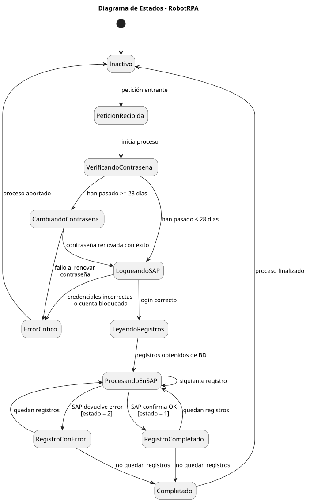
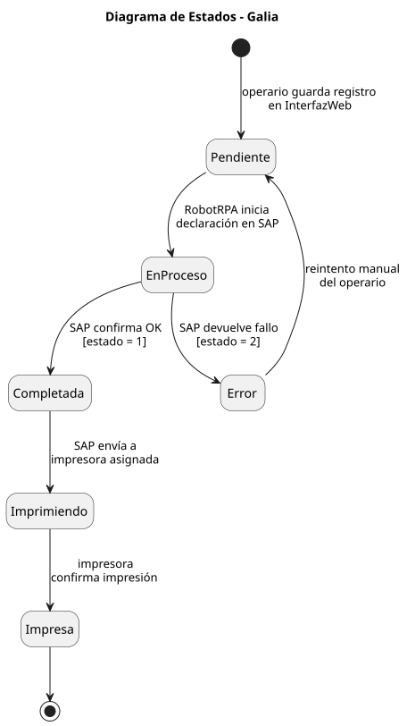
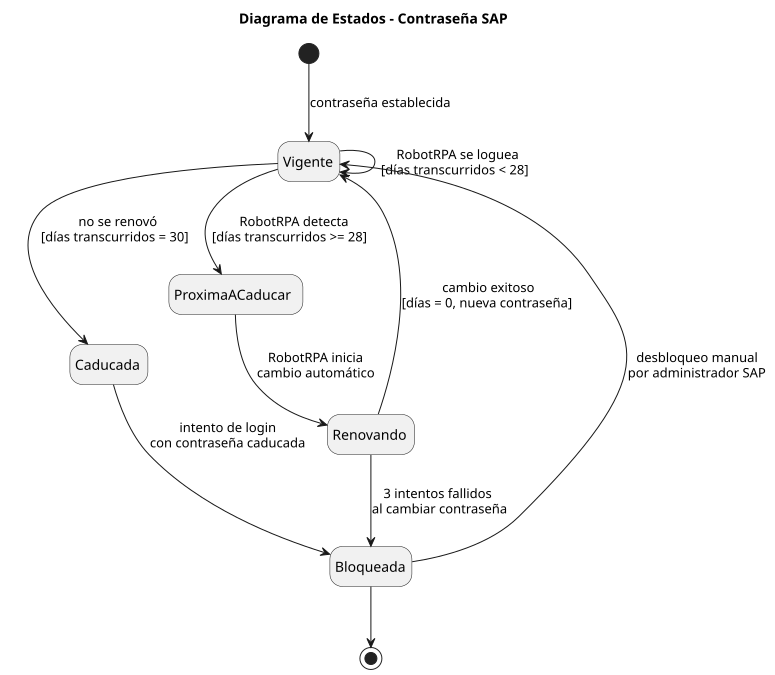

<!-- NAV: adapta los paths según la profundidad del archivo (../../) -->

<table><tr>
<td><a href="../../README.md">🏠 Inicio</a></td>
<td><b>·</b></td>
<td><a href="../../01-inicio/README.md"
   style="padding:4px 10px;border-radius:12px;color:#57606a;text-decoration:none">
   📋 01 · Inicio</a></td>
<td><b>·</b></td>
<td><a href="../../02-elaboracion/README.md"
   style="background:#dbeafe;padding:4px 10px;border-radius:12px;color:#1d4ed8;font-weight:bold;text-decoration:none">
   🔬 02 · Elaboración</a></td>
<td><b>·</b></td>
<td><a href="../../03-construccion/README.md"
   style="padding:4px 10px;border-radius:12px;color:#57606a;text-decoration:none">
   🔨 03 · Construcción</a></td>
<td><b>·</b></td>
<td><a href="../../04-transicion/README.md"
   style="padding:4px 10px;border-radius:12px;color:#57606a;text-decoration:none">
   🚀 04 · Transición</a></td>
</tr></table>

📋 Ver todas las secciones del repositorio

 

<table>
<tr><th>📋 01 · Inicio</th><th>🔬 02 · Elaboración</th><th>🔨 03 · Construcción</th><th>🚀 04 · Transición</th></tr>
<tr>
<td valign="top">

[📌 Visión y Justificación](../../01-inicio/vision-justificacion/README.md)
[🧩 Modelo del Dominio](../../01-inicio/modelo-dominio/README.md)
[👥 Actores y CU alto nivel](../../01-inicio/casos-de-uso-alto-nivel/README.md)
[⚠️ Análisis de Riesgos](../../01-inicio/analisis-riesgos/README.md)
[📖 Glosario](../../01-inicio/glosario/README.md)

</td>
<td valign="top">

[🏗️ Arquitectura del Sistema](../../02-elaboracion/arquitectura/README.md)
[🔄 Diagramas de Estado](../../02-elaboracion/diagramas-estado/README.md)
[📝 Casos de Uso Detallados](../../02-elaboracion/casos-de-uso-detallados/README.md)
[⚖️ Priorización de CU](../../02-elaboracion/priorizacion-cu/README.md)
[📋 Requisitos RF/RNF](../../02-elaboracion/requisitos/README.md)

</td>
<td valign="top">

[🎨 Diseño por Caso de Uso](../../03-construccion/diseno-por-caso-de-uso/README.md)
[📦 Análisis de Paquetes](../../03-construccion/analisis-paquetes/README.md)
[🗄️ Base de Datos](../../03-construccion/base-de-datos/README.md)
[🤖 Robot UiPath](../../03-construccion/robot-uipath/README.md)
[💻 Descripción Solución](../../03-construccion/descripcion-solucion/README.md)
[⚙️ Instalación](../../03-construccion/instalacion/README.md)

</td>
<td valign="top">

[🧪 Plan de Pruebas](../../04-transicion/plan-pruebas/README.md)
[🖥️ CU en Interfaz](../../04-transicion/cu-en-interfaz/README.md)
[📊 Resultados y Métricas](../../04-transicion/resultados-metricas/README.md)
[🎓 Conclusiones](../../04-transicion/conclusiones/README.md)

</td>
</tr>
</table>

📍 Estás en: <b>Diagramas de Estado</b>

***

# 🔄 Diagramas de Estado

En esta sección se modelan los ciclos de vida de los componentes críticos del sistema mediante diagramas de estado UML.

## Ciclo de Vida del Robot RPA

Este diagrama muestra cómo el robot transita desde la inactividad hasta la finalización del procesamiento, incluyendo la lógica de cambio de contraseña.

*Ciclo de vida del Robot RPA.*

| Estado                    | Descripción                                                         |
| ------------------------- | ------------------------------------------------------------------- |
| **Inactivo**              | El robot espera la peticion de ejecución desde el servidor Node.js. |
| **PeticionRecibida**      | El robot ha sido despertado y comienza la fase de verificación.     |
| **VerificandoContraseña** | Se comprueba si han pasado ≥28 días desde el último cambio.         |
| **CambiandoContraseña**   | Proceso autónomo de renovación de credenciales en SAP GUI.          |
| **LogueandoSAP**          | El robot introduce credenciales y accede a la transacción.          |
| **ProcesandoEnSAP**       | Bucle de procesamiento de registros con estado 0.                   |
| **ErrorCritico**          | Estado de parada ante fallos irrecuperables (bloqueo de cuenta).    |

## Ciclo de Vida de la Galia

Representa los cambios de estado de un registro de producción desde su creación hasta su impresión final.

*Ciclo de vida de la Galia.*

| Estado             | Significado                                                       |
| ------------------ | ----------------------------------------------------------------- |
| **Pendiente (0)**  | Registro guardado en BD, esperando a ser tomado por el robot.     |
| **En Proceso**     | El robot está interactuando con SAP para este registro concreto.  |
| **Completada (1)** | SAP ha aceptado la declaración y emitido la orden de impresión.   |
| **Error (2)**      | SAP ha devuelto un error (ej: orden cerrada o cantidad excedida). |

## Ciclo de Vida de la Contraseña SAP

Esencial para la robustez del sistema, asegurando que el robot nunca intente loguearse con una cuenta caducada.

*Ciclo de vida de la contraseña SAP.*

- **Vigente:** Contraseña funcional (0-27 días).
- **Próxima a Caducar:** Estado de alerta a los 28 días que dispara la renovación.
- **Bloqueada:** Estado crítico tras 3 fallos de login o caducidad total (>30 días). Requiere intervención manual.

## Decisiones de Diseño Relacionadas

- La transición a **Error (2)** en una Galia no detiene el proceso de las demás (RNF-06).

   

