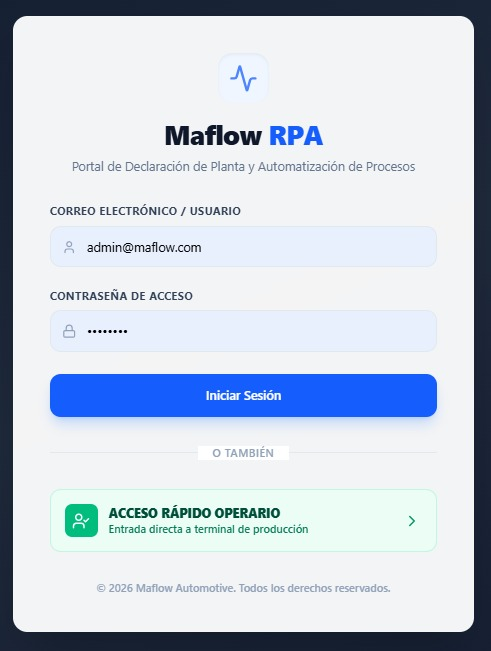
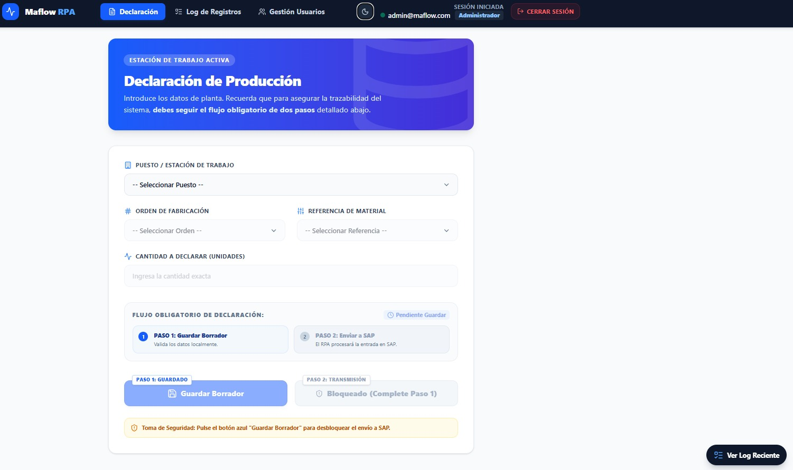
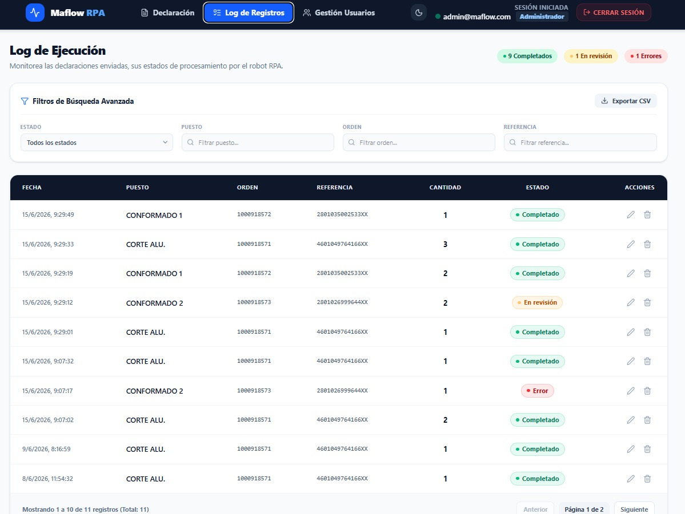
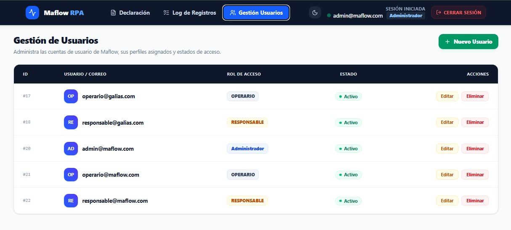

<!-- NAV: adapta los paths según la profundidad del archivo (../../) -->

<table><tr>
<td><a href="../../README.md">🏠 Inicio</a></td>
<td><b>·</b></td>
<td><a href="../../01-inicio/README.md"
   style="padding:4px 10px;border-radius:12px;color:#57606a;text-decoration:none">
   📋 01 · Inicio</a></td>
<td><b>·</b></td>
<td><a href="../../02-elaboracion/README.md"
   style="padding:4px 10px;border-radius:12px;color:#57606a;text-decoration:none">
   🔬 02 · Elaboración</a></td>
<td><b>·</b></td>
<td><a href="../../03-construccion/README.md"
   style="background:#dbeafe;padding:4px 10px;border-radius:12px;color:#1d4ed8;font-weight:bold;text-decoration:none">
   🔨 03 · Construcción</a></td>
<td><b>·</b></td>
<td><a href="../../04-transicion/README.md"
   style="padding:4px 10px;border-radius:12px;color:#57606a;text-decoration:none">
   🚀 04 · Transición</a></td>
</tr></table>

📋 Ver todas las secciones del repositorio

 

<table>
<tr><th>📋 01 · Inicio</th><th>🔬 02 · Elaboración</th><th>🔨 03 · Construcción</th><th>🚀 04 · Transición</th></tr>
<tr>
<td valign="top">

[📌 Visión y Justificación](../../01-inicio/vision-justificacion/README.md)
[🧩 Modelo del Dominio](../../01-inicio/modelo-dominio/README.md)
[👥 Actores y CU alto nivel](../../01-inicio/casos-de-uso-alto-nivel/README.md)
[⚠️ Análisis de Riesgos](../../01-inicio/analisis-riesgos/README.md)
[📖 Glosario](../../01-inicio/glosario/README.md)

</td>
<td valign="top">

[🏗️ Arquitectura del Sistema](../../02-elaboracion/arquitectura/README.md)
[🔄 Diagramas de Estado](../../02-elaboracion/diagramas-estado/README.md)
[📝 Casos de Uso Detallados](../../02-elaboracion/casos-de-uso-detallados/README.md)
[⚖️ Priorización de CU](../../02-elaboracion/priorizacion-cu/README.md)
[📋 Requisitos RF/RNF](../../02-elaboracion/requisitos/README.md)

</td>
<td valign="top">

[🎨 Diseño por Caso de Uso](../../03-construccion/diseno-por-caso-de-uso/README.md)
[📦 Análisis de Paquetes](../../03-construccion/analisis-paquetes/README.md)
[🗄️ Base de Datos](../../03-construccion/base-de-datos/README.md)
[🤖 Robot UiPath](../../03-construccion/robot-uipath/README.md)
[💻 Descripción Solución](../../03-construccion/descripcion-solucion/README.md)
[⚙️ Instalación](../../03-construccion/instalacion/README.md)

</td>
<td valign="top">

[🧪 Plan de Pruebas](../../04-transicion/plan-pruebas/README.md)
[🖥️ CU en Interfaz](../../04-transicion/cu-en-interfaz/README.md)
[📊 Resultados y Métricas](../../04-transicion/resultados-metricas/README.md)
[🎓 Conclusiones](../../04-transicion/conclusiones/README.md)

</td>
</tr>
</table>

📍 Estás en: <b>Descripción Solución</b>

***

# 💻 Descripción de la Solución Implementada

La solución final es una plataforma web integrada con un motor RPA, diseñada bajo la identidad visual "Maflow RPA". Se compone de 4 módulos funcionales.

## 1. Módulo de Acceso

Formulario de login seguro (email y contraseña) que redirige según el rol. Incluye una función de **Acceso Rápido para Operarios** que permite entrar directamente al terminal de producción de su puesto habitual sin necesidad de credenciales completas en cada turno.

*Interfaz del módulo de login.*

 

## 2. Módulo de Declaración de Producción

Es la pantalla principal para el operario. Consta de un formulario con 4 campos clave:

- **Puesto de Trabajo:** Desplegable dinámico cargado desde la BD.
- **Orden de Fabricación:** Número de la orden activa.
- **Referencia:** Material que se está fabricando.
- **Cantidad:** Unidades producidas.

**Flujo Obligatorio:**

1. **Guardar:** Persiste los datos y declara en el MES.
2. **Enviar a SAP:** Dispara el robot para completar el proceso en el ERP.

*Interfaz del módulo de declaración de producción.*

## 3. Módulo de Log de Ejecución

Tabla en tiempo real que muestra el historial de declaraciones.

- **Operarios:** Solo ven sus propios registros.
- **Responsables/Administradores:** Acceso al log completo con filtros por fecha, puesto y estado (identificado por colores: verde = éxito, rojo = error, gris = pendiente, naranja = revisión).

*Interfaz del módulo de log de ejecución.*

## 4. Módulo de Gestión de Usuarios

Exclusivo para el Administrador. Permite realizar el CRUD completo (Crear, Consultar, Actualizar, Eliminar) de los usuarios del sistema, asignando roles y gestionando sus estados de activación.

*Interfaz del módulo de gestión de usuarios.*
