<!-- NAV: adapta los paths según la profundidad del archivo (../../) -->

<table><tr>
<td><a href="../../README.md">🏠 Inicio</a></td>
<td><b>·</b></td>
<td><a href="../../01-inicio/README.md"
   style="padding:4px 10px;border-radius:12px;color:#57606a;text-decoration:none">
   📋 01 · Inicio</a></td>
<td><b>·</b></td>
<td><a href="../../02-elaboracion/README.md"
   style="padding:4px 10px;border-radius:12px;color:#57606a;text-decoration:none">
   🔬 02 · Elaboración</a></td>
<td><b>·</b></td>
<td><a href="../../03-construccion/README.md"
   style="background:#dbeafe;padding:4px 10px;border-radius:12px;color:#1d4ed8;font-weight:bold;text-decoration:none">
   🔨 03 · Construcción</a></td>
<td><b>·</b></td>
<td><a href="../../04-transicion/README.md"
   style="padding:4px 10px;border-radius:12px;color:#57606a;text-decoration:none">
   🚀 04 · Transición</a></td>
</tr></table>

📋 Ver todas las secciones del repositorio

 

<table>
<tr><th>📋 01 · Inicio</th><th>🔬 02 · Elaboración</th><th>🔨 03 · Construcción</th><th>🚀 04 · Transición</th></tr>
<tr>
<td valign="top">

[📌 Visión y Justificación](../../01-inicio/vision-justificacion/README.md) 
[🧩 Modelo del Dominio](../../01-inicio/modelo-dominio/README.md) 
[👥 Actores y CU alto nivel](../../01-inicio/casos-de-uso-alto-nivel/README.md) 
[⚠️ Análisis de Riesgos](../../01-inicio/analisis-riesgos/README.md) 
[📖 Glosario](../../01-inicio/glosario/README.md)

</td>
<td valign="top">

[🏗️ Arquitectura del Sistema](../../02-elaboracion/arquitectura/README.md) 
[🔄 Diagramas de Estado](../../02-elaboracion/diagramas-estado/README.md) 
[📝 Casos de Uso Detallados](../../02-elaboracion/casos-de-uso-detallados/README.md) 
[⚖️ Priorización de CU](../../02-elaboracion/priorizacion-cu/README.md) 
[📋 Requisitos RF/RNF](../../02-elaboracion/requisitos/README.md)

</td>
<td valign="top">

[🎨 Diseño por Caso de Uso](../../03-construccion/diseno-por-caso-de-uso/README.md) 
[📦 Análisis de Paquetes](../../03-construccion/analisis-paquetes/README.md) 
[🗄️ Base de Datos](../../03-construccion/base-de-datos/README.md) 
[🤖 Robot UiPath](../../03-construccion/robot-uipath/README.md) 
[💻 Descripción Solución](../../03-construccion/descripcion-solucion/README.md) 
[⚙️ Instalación](../../03-construccion/instalacion/README.md)

</td>
<td valign="top">

[🧪 Plan de Pruebas](../../04-transicion/plan-pruebas/README.md) 
[🖥️ CU en Interfaz](../../04-transicion/cu-en-interfaz/README.md) 
[📊 Resultados y Métricas](../../04-transicion/resultados-metricas/README.md) 
[🎓 Conclusiones](../../04-transicion/conclusiones/README.md)

</td>
</tr>
</table>

📍 Estás en: <b>Diseño por Caso de Uso</b>

***

# 🎨 Diseño por Caso de Uso

Para asegurar una implementación robusta, cada caso de uso prioritario (CU1-CU9) cuenta con un diseño detallado siguiendo el patrón MVC.

## Artefactos de Diseño
Para cada caso de uso se han generado:
1.  **Diagrama de Clases de Diseño:** Mapeo de las clases de la vista, el controlador y el modelo involucradas.
2.  **Diagrama de Secuencia:** Modelado de la interacción temporal entre los objetos del sistema.
3.  **Mockup / Pantalla Real:** Representación visual de la interfaz final.

## CU Iniciar Sesion
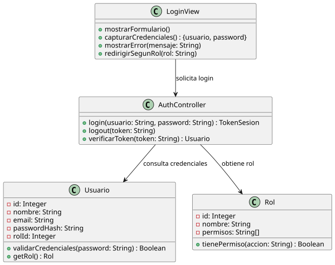

*Diagrama de clases para el inicio de sesión.*

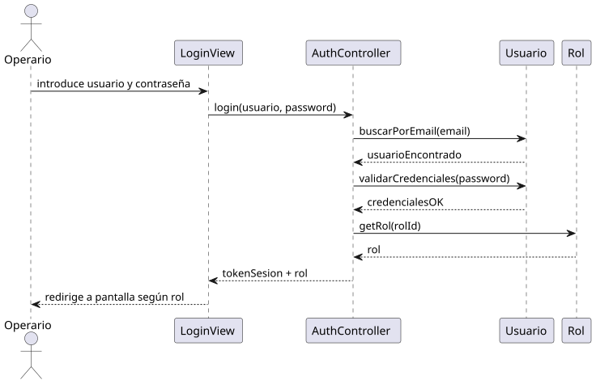

*Diagrama de secuencia para el inicio de sesión.*

## CU Cambiar Contraseña Automáticamente
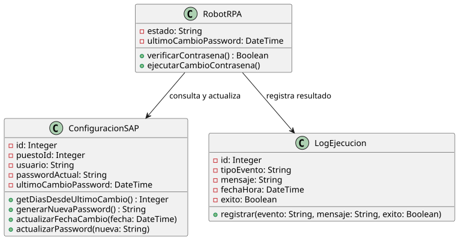

*Diagrama de clases para el cambio de contraseña automático.*

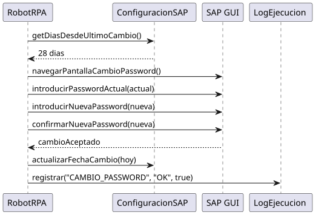

*Diagrama de secuencia para el cambio de contraseña automático.*

## CU Consultar Log
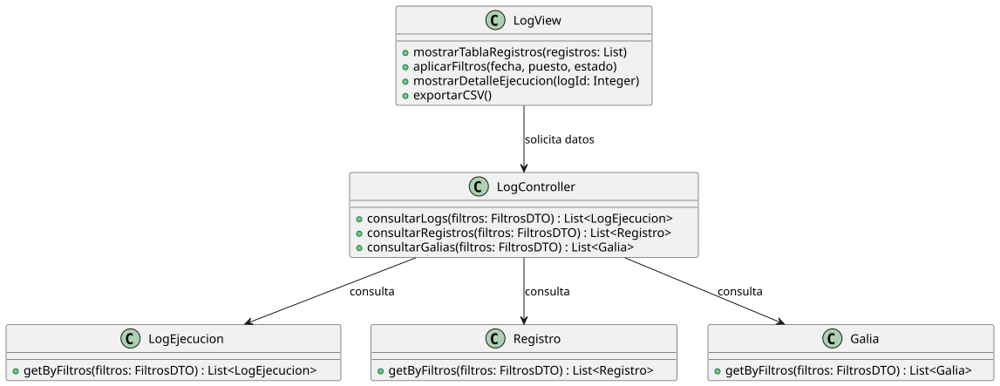

*Diagrama de clases para la consulta de logs.*

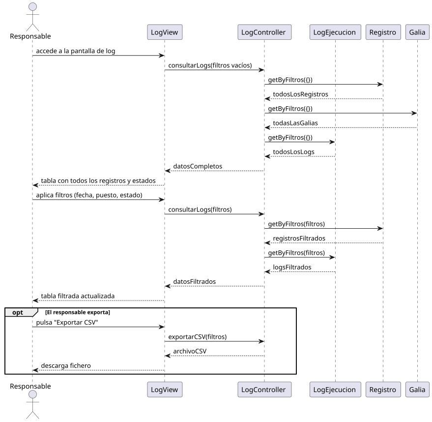

*Diagrama de secuencia para la consulta de logs.*

## CU Enviar ASAP
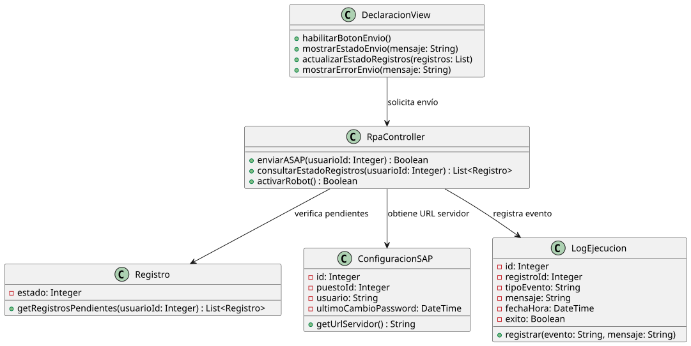

*Diagrama de clases para el envío a ASAP.*

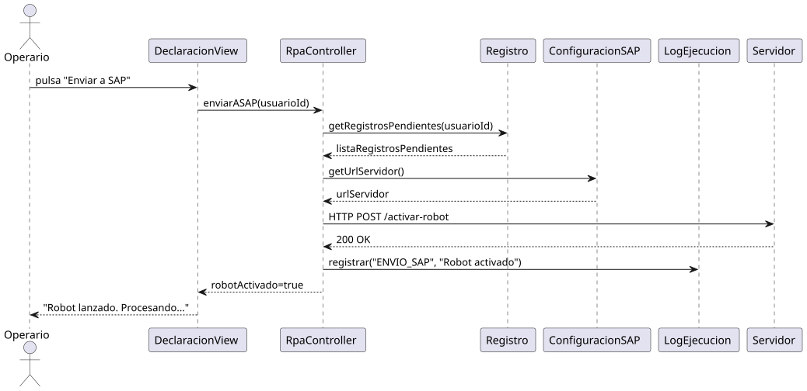

*Diagrama de secuencia para el envío a ASAP.*

## CU Gestionar Usuarios
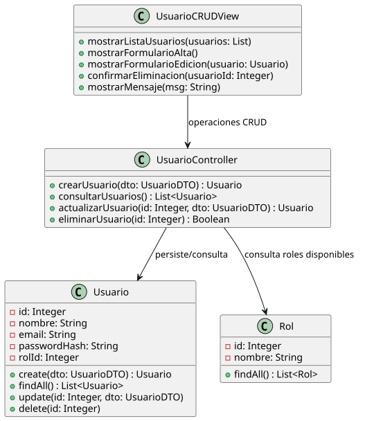

*Diagrama de clases para la gestión de usuarios.*

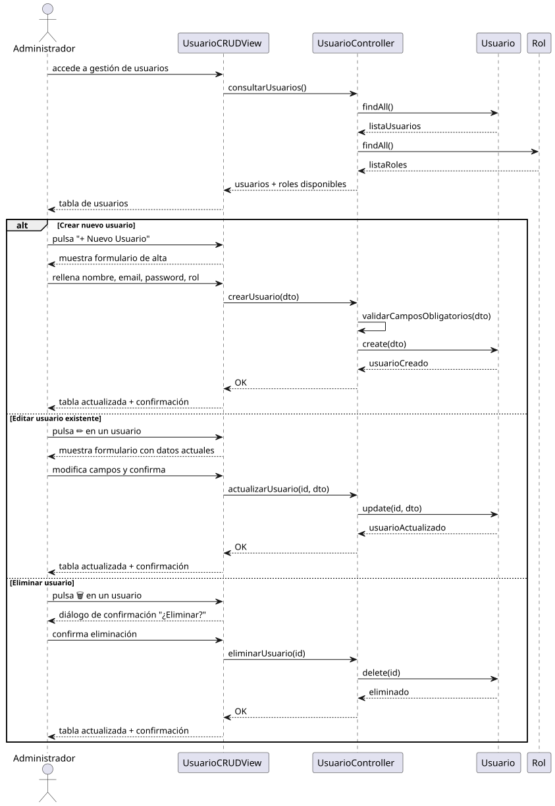

*Diagrama de secuencia para la gestión de usuarios.*

## CU Guardar Registro
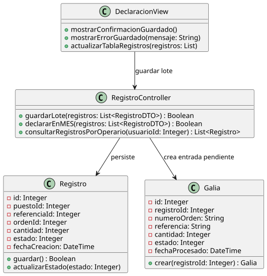

*Diagrama de clases para el guardado de registros.*

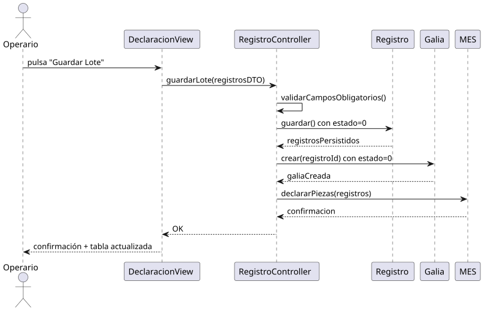

*Diagrama de secuencia para el guardado de registros.*

## CU Imprimir Galia
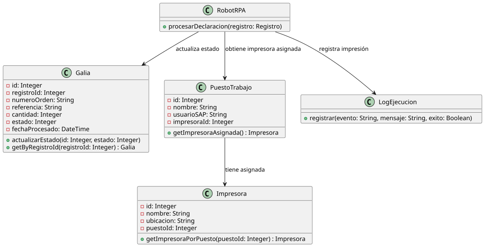

*Diagrama de clases para la impresión en Galia.*

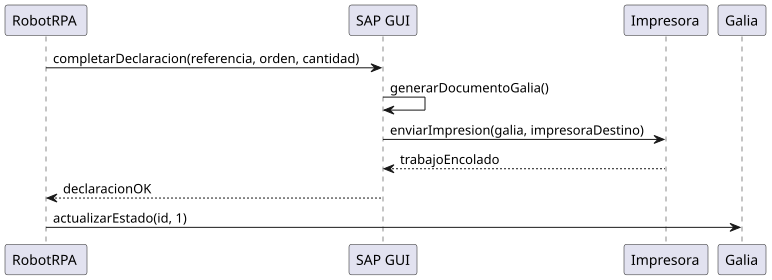

*Diagrama de secuencia para la impresión en Galia.*

## CU Procesar Declaraciones
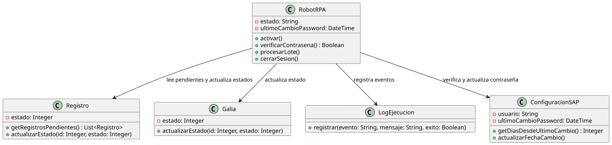

*Diagrama de clases para el procesamiento de declaraciones.*

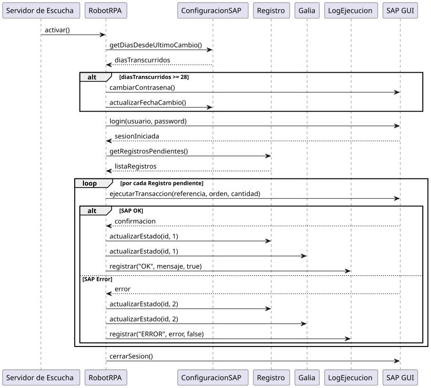

*Diagrama de secuencia para el procesamiento de declaraciones.*

## CU Registrar Declaracion
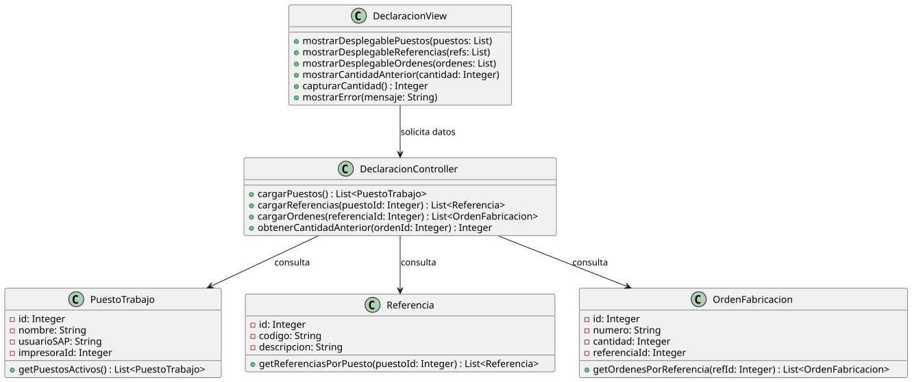

*Diagrama de clases para el registro de declaraciones.*

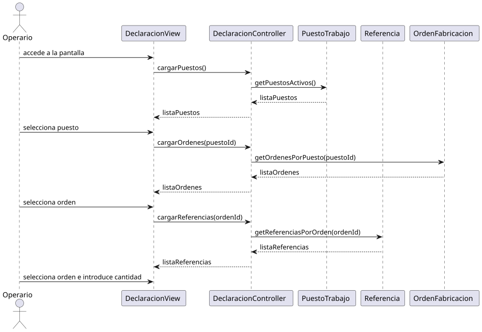

*Diagrama de secuencia para el registro de declaraciones.*

## Relaciones
- Estos diseños concretan la [Arquitectura](../../02-elaboracion/arquitectura/README.md) definida en la fase anterior.
- Los flujos de secuencia alimentan la lógica implementada en el [Robot UiPath](../robot-uipath/README.md).
