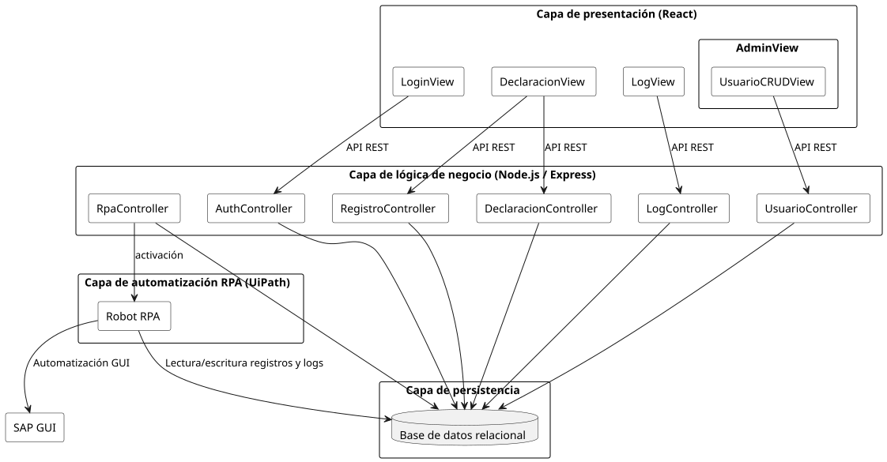

# 05 · Arquitectura del Sistema

La arquitectura se ha diseñado para solventar la restricción técnica de no poseer APIs en SAP, utilizando una estructura de 4 capas que aísla la complejidad de la automatización.

## Las 4 Capas de la Solución

1. **Capa de Presentación (React):** Interfaz web moderna para los distintos actores (Operario, Responsable, Administrador). Se comunica con el backend mediante una API REST.
2. **Capa de Lógica de Negocio (Node.js/Express):** Gestiona la lógica, autenticación, coordinación de la BD y el disparo de las ejecuciones del robot.
3. **Capa de Persistencia (MS SQL Server):** Almacena registros, logs y configuraciones.
4. **Capa de Automatización (UiPath):** El componente "manos" del sistema. Interactúa con la GUI de SAP de forma autónoma.

### Diagrama de Arquitectura

## Patrón MVC Aplicado
El sistema sigue estrictamente el patrón **Modelo-Vista-Controlador**:
- **Modelo:** Entidades del dominio y lógica de acceso a datos (Sequelize/SQL Server).
- **Vista:** Interfaces React específicas por actor.
- **Controlador:** Endpoints de Node.js que orquestan los casos de uso.

## Principio de Aislamiento
Cualquier cambio en la interfaz gráfica de SAP (actualizaciones de versión, cambios de campos) solo afecta a la **Capa de Automatización**. La interfaz web y la lógica de negocio permanecen inalteradas, garantizando un mantenimiento sostenible.

---

| ← Anterior | Inicio | Siguiente → |
|:---:|:---:|:---:|
| [04 · Casos de Uso Detallados](../04_cu_detallados/README.md) | [🏠 Inicio](../README.md) | [06 · Base de Datos](../06_base_de_datos/README.md) |

