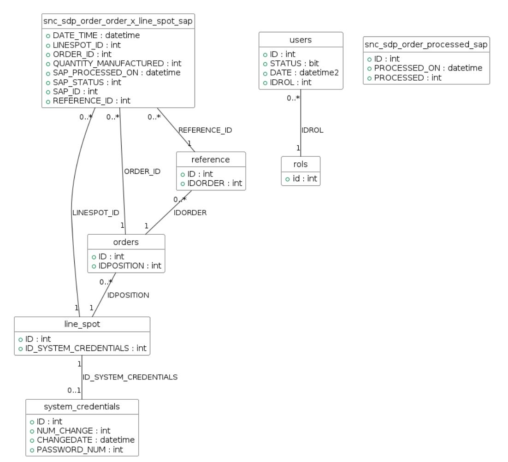

# 06 · Base de Datos

El sistema utiliza Microsoft SQL Server como motor de persistencia, compartiendo instancia con el sistema MES Apriso de la planta para facilitar la integración de datos de producción.

## Modelo Entidad-Relación
El diseño de la base de datos se centra en la trazabilidad de las declaraciones y la gestión de credenciales por puesto de trabajo.

## Tablas Principales

| Tabla | Descripción |
| :--- | :--- |
| **sncsdporderorderxlinespotsap** | Tabla central que almacena los registros de declaración y su estado (0, 1, 2). |
| **linespot** | Define los puestos físicos de producción. |
| **systemcredentials** | Almacena el usuario y contraseña (cifrada) de SAP para cada puesto. |
| **users / rols** | Gestión de usuarios de la aplicación y sus permisos. |

## Decisión Crítica de Diseño
La tabla **linespot** actúa como el eje del sistema. Al vincular el puesto físico con un registro de credenciales, el sistema determina automáticamente qué usuario de SAP debe usar el robot. Esto es vital porque el usuario de SAP determina físicamente a qué impresora de planta se envía la Galia.

---

| ← Anterior | Inicio | Siguiente → |
|:---:|:---:|:---:|
| [05 · Arquitectura](../05_arquitectura/README.md) | [🏠 Inicio](../README.md) | [07 · Demo](../07_demo/README.md) |

