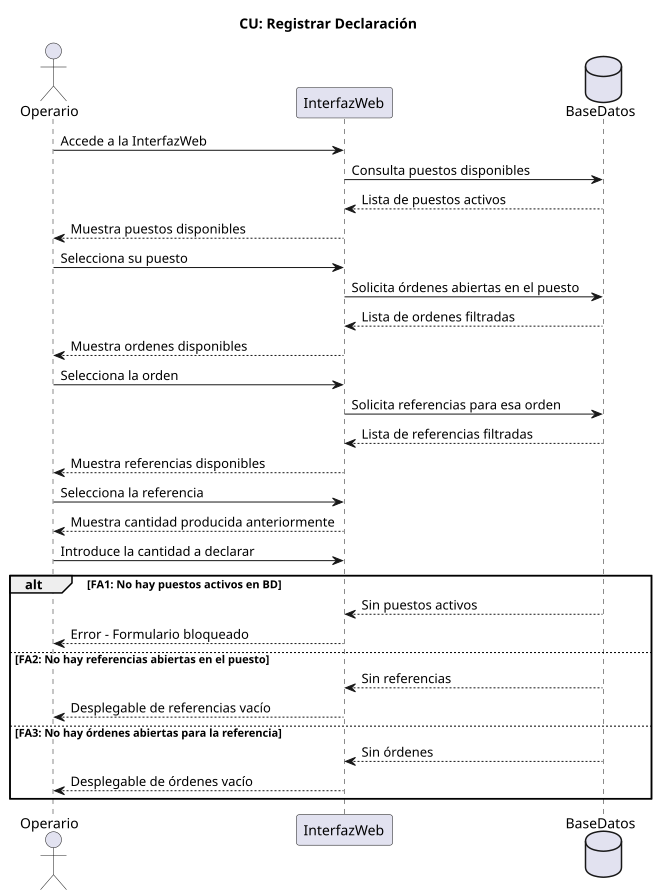
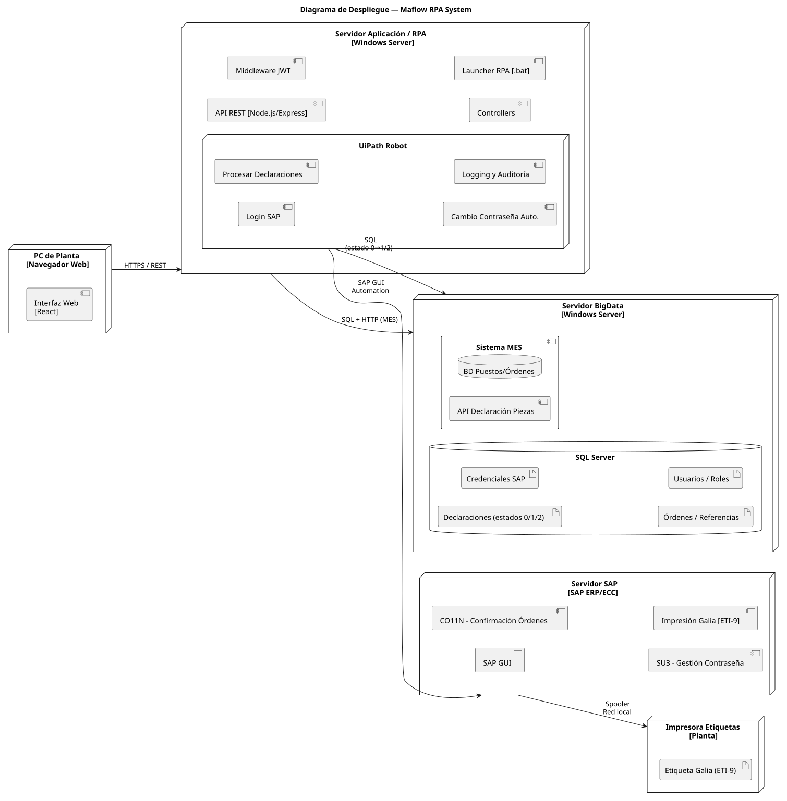

# Sistema de Automatización RPA para Optimización de Procesos SAP en Maflow Spain Automotive

## Descripción del Proyecto

Este repositorio contiene la documentación técnica completa del Trabajo de Fin de Grado (TFG) enfocado en la automatización de procesos industriales mediante RPA (Robotic Process Automation) para la generación de documentos Galia en el entorno SAP de Maflow Spain Automotive.

La solución permite integrar el sistema MES de planta con el ERP SAP de forma eficiente, eliminando la duplicidad de tareas y reduciendo drásticamente los tiempos de proceso.

***

# 01 · Presentación del Proyecto

## Problema detectado en Maflow Spain Automotive

El proceso de generación de documentos **Galia (ETI 9)** en SAP presentaba graves deficiencias operativas antes de la implementación de esta solución:

- **Lentitud extrema:** El proceso manual consumía aproximadamente 2 minutos por cada documento.
- **Duplicidad de esfuerzo:** Los operarios introducían los mismos datos manualmente tanto en SAP como en el sistema MES (Apriso).
- **Restricción técnica:** La ausencia de acceso a APIs de SAP impedía el uso de métodos de integración convencionales.
- **Falta de escalabilidad:** No existía capacidad de procesamiento en lote; cada documento debía generarse de forma individual.
- **Riesgo de calidad:** Los errores de transcripción manual afectaban negativamente la trazabilidad entre Maflow y sus clientes OEM.

## Solución Propuesta

Se ha desarrollado una solución basada en **RPA (Robotic Process Automation)** que opera directamente sobre la SAP GUI, superando la limitación de falta de APIs.

### Flujo de Trabajo

1. El operario introduce los datos en la **Interfaz Web**.
2. Al pulsar **Guardar**, los datos se persisten en la BD y se declaran en el sistema MES.
3. Al pulsar **Enviar a SAP**, se activa el robot UiPath.
4. El robot se loguea en SAP y procesa en lote todos los registros pendientes.

## Modelo del Dominio

El modelo del dominio identifica las entidades fundamentales que participan en el proceso de automatización.

### Diagrama de Clases

### Entidades Principales

| Entidad           | Descripción                                                        |
| :---------------- | :----------------------------------------------------------------- |
| **Operario**      | Usuario final que introduce los datos en la interfaz web.          |
| **PuestoTrabajo** | Determina las credenciales de acceso a SAP y la impresora destino. |
| **RobotRPA**      | Proceso automatizado encargado de la interacción con SAP.          |
| **Galia**         | Documento de trazabilidad objeto de la automatización.             |

### Escenario de Ejemplo (Diagrama de Objetos)

***

# 02 · Actores y Casos de Uso

En esta sección se identifican los actores que interactúan con el sistema y las funcionalidades principales agrupadas a alto nivel.

## Actores del Sistema

| Actor             | Tipo      | Descripción                                                       |
| :---------------- | :-------- | :---------------------------------------------------------------- |
| **Operario**      | Principal | Introduce datos de producción y activa el proceso de envío a SAP. |
| **Responsable**   | Principal | Supervisa los logs de ejecución y gestiona registros existentes.  |
| **Administrador** | Principal | Gestiona los usuarios del sistema y la configuración global.      |
| **Robot RPA**     | Sistema   | Ejecuta de forma autónoma las tareas en la interfaz de SAP.       |
| **SAP / MES**     | Externo   | Sistemas con los que se integra la solución.                      |

### Relaciones entre Actores

## Diagrama de Contexto

El diagrama de contexto muestra los límites del sistema, agrupando los casos de uso por las pantallas principales (Declaración, Log Completo y Gestión de Usuarios) y detallando las interacciones con sistemas externos.

*Organización del sistema por pantallas y accesos de actores.*

## Diagramas de Casos de Uso (Alto Nivel)

### Casos de Uso: Operario

### Casos de Uso: Responsable

### Casos de Uso: Administrador

### Casos de Uso: Robot RPA

***

# 03 · Requisitos No Funcionales (RNF)

Los requisitos no funcionales garantizan la calidad, seguridad y rendimiento del sistema, asegurando que la automatización sea fiable en el entorno crítico de la planta.

## Principales RNF del Sistema

### Rendimiento

- **RNF-01:** El robot debe procesar cada registro en SAP en un tiempo máximo de 15 segundos por Galia.
- **RNF-03:** El sistema debe soportar el procesamiento de al menos 20 Galias en una misma ejecución de lote.

### Disponibilidad

- **RNF-04:** El servidor de aplicaciones debe estar operativo 24/7 durante todos los turnos de producción.
- **RNF-06:** Ante un fallo en un registro concreto, el sistema NO debe interrumpir el procesamiento del resto del lote.

### Seguridad

- **RNF-07:** El cambio automático de contraseña debe ejecutarse cada 28 días para cumplir con la política de SAP.
- **RNF-08:** El robot no debe realizar más de 2 intentos de login fallidos para evitar el bloqueo de la cuenta.

### Mantenibilidad

- **RNF-10:** Los estados de los registros (0=pendiente, 1=éxito, 2=error) deben persistirse en la BD.
- **RNF-11:** El sistema debe registrar logs detallados de cada ejecución del robot.

### Plataforma

- **RNF-12:** Interfaz web desarrollada con React y Node.js/Express.
- **RNF-15:** Base de datos Microsoft SQL Server compartida con el MES Apriso.

***

# 04 · Casos de Uso Detallados

En esta sección se profundiza en los 4 casos de uso críticos que forman el núcleo del sistema de automatización.

## 4.1. Registrar Declaración

Captura de datos inicial en la interfaz web.

| Campo | Descripción |
| :--- | :--- |
| **Actor principal** | Operario |
| **Precondición** | El operario tiene acceso a la Interfaz Web y hay puestos activos en el MES. |
| **Postcondición** | Puesto, referencia, orden y cantidad listos para guardar. |

### Diagrama de Secuencia

### Flujo Principal
1. El operario accede a la Interfaz Web.
2. El sistema consulta al MES y muestra los puestos disponibles.
3. El operario selecciona su puesto.
4. El sistema filtra y muestra las referencias con órdenes abiertas en ese puesto.
5. El operario selecciona la orden.
6. El sistema muestra las referencias para esa orden.
7. El operario selecciona la referencia.
8. El sistema muestra la cantidad producida anteriormente.
9. El operario introduce la cantidad a declarar.

---

## 4.2. Enviar a SAP

Disparo de la petición de automatización.

| Campo | Descripción |
| :--- | :--- |
| **Actor principal** | Operario |
| **Precondición** | Al menos un registro guardado en BD con estado = 0. |
| **Postcondición** | Petición enviada al servidor y RobotRPA activado. |

### Diagrama de Secuencia

### Flujo Principal
1. El operario pulsa el botón Enviar a SAP.
2. El sistema verifica que existen registros pendientes con estado = 0 en la BD.
3. El sistema lanza una petición al servidor de ejecución del RPA.
4. El servidor recibe la petición y confirma la recepción.
5. El servidor activa la ejecución del RobotRPA.
6. El sistema notifica al operario que el proceso ha sido lanzado correctamente.

---

## 4.3. Procesar Declaración

Ejecución de la lógica del robot en SAP GUI.

| Campo | Descripción |
| :--- | :--- |
| **Actor principal** | RobotRPA |
| **Precondición** | Petición recibida por el servidor; registros con estado = 0 en BD. |
| **Postcondición** | Todos los registros procesados con estado = 1 o estado = 2; galias enviadas a imprimir. |

### Diagrama de Secuencia

### Flujo Principal
1. El RobotRPA es activado por el servidor.
2. El robot verifica los días transcurridos desde el último cambio de contraseña.
3. El robot se loguea en SAP con el usuario correspondiente al puesto de trabajo.
4. El robot escribe la transacción en el buscador de SAP y la ejecuta.
5. El robot lee el primer registro con estado = 0 de la BD.
6. El robot completa los campos en SAP: referencia, orden y cantidad.
7. SAP procesa la declaración y envía la galia a imprimir.
8. El robot actualiza el registro en BD a estado = 1.
9. El robot repite hasta agotar todos los registros pendientes.

---

## 4.4. Cambio de Contraseña Automático

Mantenimiento autónomo de credenciales.

| Campo | Descripción |
| :--- | :--- |
| **Actor principal** | RobotRPA |
| **Precondición** | Han transcurrido ≥ 28 días desde el último cambio de contraseña. |
| **Postcondición** | Contraseña renovada en SAP y contador de días reiniciado a 0. |

### Diagrama de Secuencia

### Flujo Principal
1. El robot detecta que han pasado ≥ 28 días desde el último cambio.
2. El robot accede a la pantalla de cambio de contraseña de SAP.
3. El robot introduce la contraseña actual.
4. El robot genera y escribe la nueva contraseña siguiendo la política de SAP.
5. El robot confirma la nueva contraseña.
6. SAP valida y acepta el cambio.
7. El robot actualiza el registro de fecha del último cambio.

---

## Resumen de Actores involucrados

- **Operario:** Inicia el proceso mediante el registro y envío.
- **Robot RPA:** Ejecuta la lógica de procesamiento y mantenimiento en SAP.

***

# 05 · Arquitectura del Sistema

La arquitectura se ha diseñado para solventar la restricción técnica de no poseer APIs en SAP, utilizando una estructura de 4 capas que aísla la complejidad de la automatización.

## Las 4 Capas de la Solución

1. **Capa de Presentación (React):** Interfaz web moderna para los distintos actores (Operario, Responsable, Administrador). Se comunica con el backend mediante una API REST.
2. **Capa de Lógica de Negocio (Node.js/Express):** Gestiona la lógica, autenticación, coordinación de la BD y el disparo de las ejecuciones del robot.
3. **Capa de Persistencia (MS SQL Server):** Almacena registros, logs y configuraciones.
4. **Capa de Automatización (UiPath):** El componente "manos" del sistema. Interactúa con la GUI de SAP de forma autónoma.

### Diagrama de Arquitectura

### Diagrama de Despliegue

## Patrón MVC Aplicado

El sistema sigue estrictamente el patrón **Modelo-Vista-Controlador**:

- **Modelo:** Entidades del dominio y lógica de acceso a datos (Sequelize/SQL Server).
- **Vista:** Interfaces React específicas por actor.
- **Controlador:** Endpoints de Node.js que orquestan los casos de uso.

## Principio de Aislamiento

Cualquier cambio en la interfaz gráfica de SAP (actualizaciones de versión, cambios de campos) solo afecta a la **Capa de Automatización**. La interfaz web y la lógica de negocio permanecen inalteradas, garantizando un mantenimiento sostenible.

***

# 06 · Base de Datos

El sistema utiliza Microsoft SQL Server como motor de persistencia, compartiendo instancia con el sistema MES Apriso de la planta para facilitar la integración de datos de producción.

## Modelo Entidad-Relación

El diseño de la base de datos se centra en la trazabilidad de las declaraciones y la gestión de credenciales por puesto de trabajo.

## Tablas Principales

| Tabla                            | Descripción                                                                    |
| :------------------------------- | :----------------------------------------------------------------------------- |
| **sncsdporderorderxlinespotsap** | Tabla central que almacena los registros de declaración y su estado (0, 1, 2). |
| **linespot**                     | Define los puestos físicos de producción.                                      |
| **systemcredentials**            | Almacena el usuario y contraseña (cifrada) de SAP para cada puesto.            |
| **users / rols**                 | Gestión de usuarios de la aplicación y sus permisos.                           |

## Decisión Crítica de Diseño

La tabla **linespot** actúa como el eje del sistema. Al vincular el puesto físico con un registro de credenciales, el sistema determina automáticamente qué usuario de SAP debe usar el robot. Esto es vital porque el usuario de SAP determina físicamente a qué impresora de planta se envía la Galia.

***

# 07 · Demo del Sistema

En esta sección se muestra el funcionamiento real de la solución implementada a través de capturas de la interfaz y una demostración en vídeo.

## Interfaz de Usuario

### 1. Módulo de Login

*Acceso seguro y gestión de sesiones.*

### 2. Módulo de Declaración (Operario)

*Formulario optimizado para la entrada rápida de datos en planta.*

### 3. Módulo de Log de Ejecución

*Trazabilidad en tiempo real de los procesos del robot.*

## 🎥 Video de Demostración

En el siguiente vídeo se puede observar el flujo completo: desde la entrada de datos por el operario hasta la ejecución autónoma del robot en SAP.

<video src="./07_demo/videoDemoTFG.mp4" controls width="100%"></video>

***

# 08 · Resultados y Conclusiones

Tras el despliegue y validación del sistema en Maflow Spain Automotive, se presentan los resultados obtenidos y las conclusiones finales del proyecto.

## Resultados y Métricas de Impacto

| Métrica                      | Antes (Manual) | Después (RPA)    | Mejora     |
| :--------------------------- | :------------- | :--------------- | :--------- |
| **Tiempo por documento**     | \~120 segundos | \~15 segundos    | **-87.5%** |
| **Errores de transcripción** | Frecuentes     | Prácticamente 0  | **-95%**   |
| **Procesamiento en lote**    | No disponible  | Hasta 20+ Galias | **Alta**   |

### Trazabilidad y Calidad

El 100% de las acciones del robot quedan registradas, permitiendo auditorías inmediatas y eliminando la incertidumbre sobre qué documentos han sido procesados correctamente en SAP.

## Conclusiones

- **Eficacia del RPA:** Se confirma como la tecnología ideal para integrar sistemas rígidos (SAP sin APIs) en entornos industriales.
- **Robustez Arquitectónica:** El diseño en 4 capas asegura que el sistema sea mantenible a largo plazo.
- **Impacto Operativo:** El operario puede dedicar el 87% del tiempo ahorrado a tareas de mayor valor añadido en la producción.

## Futuras Líneas de Actuación

1. **Ampliación de alcance:** Extender el robot a otras transacciones (picking, recepción de pedidos).
2. **IA y Hyperautomation:** Incorporar modelos de IA para lectura de documentos no estructurados.
3. **Monitorización avanzada:** Desarrollar dashboards analíticos en tiempo real para gerencia.

***

**Autor:** Diego García Niño\
**Tutor:** Pablo Herrero García\
**Fecha:** Junio 2026
